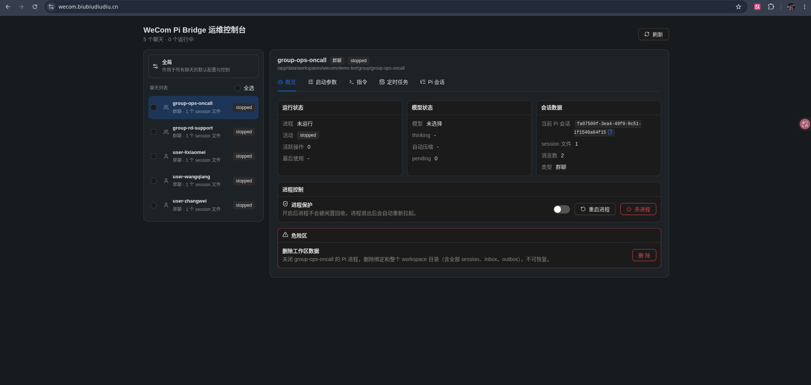

# wecom-pi-bridge

[中文](./README.zh-CN.md) | **English**

`wecom-pi-bridge` connects a WeCom intelligent bot to local Pi RPC sessions. It receives WeCom messages, maps each chat to a stable workspace/session, forwards prompts to Pi, and sends Pi's text/file replies back to WeCom.



## Features

- WeCom intelligent bot WebSocket integration.
- Stable per-chat workspace, inbox, outbox, and `.pi-sessions` binding.
- Pi RPC process spawning, reuse, idle cleanup, and protected-runtime controls.
- Text, file, image, and video message forwarding.
- Outbound file delivery through `outbox/` and `wecom_files`.
- Operations console for session state, Pi control commands, session JSONL browsing, new/switch session, startup args, process control, and scheduled tasks.
- Global or workspace-scoped Pi startup args using raw argv JSON.
- Scheduled tasks with global or single-session scope, `once`, `cron`, manual run-now, and ordered `prompt` / `control` steps.
- Structured JSON logs.
- Dockerfile and docker-compose deployment entry points.

## Architecture

```text
WeCom Bot
  |
  | WebSocket callbacks
  v
WeComBridge
  |
  | per-chat queue
  v
ConversationDispatcher
  |
  | RuntimeManager
  v
Pi RPC process
  |
  | Pi-owned jsonl session files
  v
Workspace/.pi-sessions
```

Main modules:

- `src/server/main.ts`: service entrypoint and background schedulers.
- `src/server/app.ts`: HTTP API and static Web UI serving.
- `src/server/wecom/wecom-bot.ts`: WeCom SDK connection.
- `src/server/wecom/wecom-bridge.ts`: WeCom message entrypoint.
- `src/server/wecom/conversation-dispatcher.ts`: prompt dispatch, reply delivery, and outbound files.
- `src/server/runtime/runtime-manager.ts`: Pi process lifecycle management.
- `src/server/pi/pi-rpc-client.ts`: Pi JSONL RPC client.
- `src/server/bindings/binding-store.ts`: chat bindings and runtime policy.
- `src/server/startup/`: Pi startup-arg validation and bridge-owned startup prompt file.
- `src/server/scheduler/`: scheduled task store, cron calculation, and executor.
- `src/server/admin/`: admin session control service.
- `src/web/main.tsx`: operations console frontend.

## Requirements

- Node.js compatible with the current TypeScript/ESM toolchain.
- A runnable Pi command configured through `PI_COMMAND`.
- WeCom intelligent bot ID and secret.

## Configuration

Copy the example environment file:

```powershell
Copy-Item .env.example .env
```

Important environment variables:

```env
NODE_ENV=development
HOST=127.0.0.1
PORT=3000
DATA_DIR=./data
PI_COMMAND=pi
MAX_PROCESSES=50
IDLE_TIMEOUT_MS=1800000
WECOM_BOT_ID=
WECOM_BOT_SECRET=
WECOM_BOT_WS_URL=
```

- `DATA_DIR`: data root for SQLite, workspaces, and session files.
- `PI_COMMAND`: Pi executable or script path.
- `MAX_PROCESSES`: maximum live Pi RPC processes.
- `IDLE_TIMEOUT_MS`: idle duration before cleanup.
- `WECOM_BOT_ID` / `WECOM_BOT_SECRET`: WeCom bot credentials.
- `WECOM_BOT_WS_URL`: optional WebSocket URL override.

## Development

```powershell
npm install --ignore-scripts
npm run dev:server
npm run dev:web
npm run check
npm run build
```

The local backend connects to the WeCom WebSocket and may take over the production connection. When only working on the UI, prefer `npm run dev:web`.

## Docker Deployment

```bash
docker build -t wecom-pi-bridge:latest .
docker compose up -d
```

The container listens on `3000` by default and stores data under `/app/data`.

## Data Layout

```text
data/
  app.db
  workspaces/
    wecom/
      <botId>/
        single/
          <userId>/
            .pi-sessions/
            inbox/
            outbox/
        group/
          <chatId>/
            .pi-sessions/
            inbox/
            outbox/
```

`app.db` stores chat bindings, runtime policy, startup args, and scheduled tasks. Pi writes session content under `.pi-sessions/`.

## Message Flow

1. WeCom sends a WebSocket callback.
2. The bridge resolves chat identity.
3. It gets or creates binding, workspace, and session.
4. The message enters the per-chat queue.
5. `RuntimeManager` starts or reuses Pi RPC.
6. The prompt is delivered and the bridge waits for Pi `agent_end`.
7. The bridge reads the last assistant text.
8. It strips `wecom_files` JSON and sends text/files back.

Group replies mention the original sender by default. Scheduled task replies do not force a mention.

## Attachments

WeCom file, image, and video messages are saved under the current workspace `inbox/`; the relative path is forwarded to Pi:

```text
用户发送了文件：report.pdf
文件路径：inbox/msg-id/report-random.pdf
请根据用户之前的指令或者根据后续用户的指令做出行动。
```

Voice callbacks are handled as `voice.content` text from the SDK. Audio files such as `.mp3` or `.wav` are saved as file attachments when WeCom delivers them as files.

## Pi Outbound Files

The bridge appends a bridge-owned system prompt when a Pi process starts. That prompt describes the WeCom outbound file protocol: when Pi needs WeCom to send a generated file, it writes the file under `outbox/` and outputs a JSON directive.

The prompt is injected through Pi startup args:

```text
--append-system-prompt <DATA_DIR>/startup-prompts/wecom-file-protocol.md
```

It is no longer injected into the first user message; user prompts are forwarded unchanged.

```json
{"wecom_files":[{"path":"outbox/report.xlsx","type":"file"}]}
```

Rules:

- `path` must be relative and under `outbox/`.
- Prefer `type: "file"`. Legacy `image`, `voice`, and `video` directives are still accepted but are sent as ordinary file attachments.
- The bridge scans the whole reply; the JSON does not have to be the final line.
- The JSON is removed from user-facing text.

## Pi Startup Args

The operations console can configure Pi startup args as raw argv JSON:

```json
[
  "--model",
  "opencode-go/glm-5.2",
  "--thinking",
  "high",
  "--system-prompt",
  "You are a WeCom engineering and operations assistant."
]
```

Scopes:

- Global startup args: default for every workspace.
- Workspace startup args: applies to the selected single-chat or group workspace.

Workspace args override global args. Saving `[]` at workspace scope means "override global with no extra admin args"; clearing workspace args means "inherit global".

The bridge owns and blocks these args because they are required for RPC/session binding:

```text
--mode
--session-id
--session-dir
--session
--continue
--resume
--fork
--no-session
--name
--print
--export
--list-models
--help
--version
```

Other Pi args are passed through as-is. `--system-prompt` and `--append-system-prompt` may receive either literal text or a file path readable by the Pi process in its runtime environment.

Saving startup args does not affect already-running Pi processes; the next process start uses the new args. "Save and restart" restarts the relevant Pi process only. It does not reset the workspace, switch sessions, or edit session JSONL; if protected runtime is enabled, the process is restarted immediately after shutdown.

## Scheduled Tasks

Scheduled tasks deliver ordered steps to Pi sessions by time or manual trigger.

Scope:

- `global`: runs for all known sessions.
- `session`: runs for one selected session.

Schedule types:

- `once`: run once at a specified time.
- `cron`: five-field cron expression.
- Run Now button: manual one-off execution without changing the schedule.

Step types:

- `prompt`: delivered like a WeCom message; Pi text and file replies are sent back.
- `control`: runs a Pi RPC control command without sending the command result to WeCom.

Example:

```json
[
  {
    "type": "control",
    "command": {
      "type": "set_thinking_level",
      "level": "high"
    }
  },
  {
    "type": "prompt",
    "message": "Please summarize recent TODOs in this session."
  }
]
```

If the scheduler starts a sleeping Pi process, it shuts it down after the task finishes. If the process was already running, the scheduler leaves it running.

## Operations Console

The Web UI provides:

- Session list and runtime state.
- Current model, thinking level, pending count, and PID.
- Pi session JSONL browsing.
- Create a new Pi session and bind the current workspace to it.
- Switch the current workspace to an existing Pi session file.
- Global or workspace-scoped startup arg configuration.
- Global or single-session control commands.
- Runtime protection, stop, terminate, and reset.
- Global or single-session scheduled task configuration.

Main APIs:

- `GET /api/health`
- `GET /api/chats`
- `GET /api/session?chatKey=<chatKey>&sessionId=<sessionId>`
- `GET /api/admin/sessions`
- `GET /api/admin/startup-args`
- `PUT /api/admin/startup-args`
- `PUT /api/admin/sessions/:sessionKey/startup-args`
- `DELETE /api/admin/sessions/:sessionKey/startup-args`
- `POST /api/admin/sessions/restart`
- `POST /api/admin/sessions/:sessionKey/restart`
- `POST /api/admin/sessions/:sessionKey/new-session`
- `POST /api/admin/sessions/:sessionKey/switch-session`
- `POST /api/admin/sessions/control`
- `POST /api/admin/sessions/:sessionKey/control`
- `GET /api/admin/scheduled-tasks`
- `POST /api/admin/scheduled-tasks`
- `PUT /api/admin/scheduled-tasks/:taskId`
- `DELETE /api/admin/scheduled-tasks/:taskId`
- `POST /api/admin/scheduled-tasks/:taskId/run`

## Logs

Useful structured log events:

- `message.received`
- `pi.reply`
- `attachment.saved`
- `outbound_file.sent`
- `outbound_file.ignored`
- `scheduled_task.started`
- `scheduled_task.finished`
- `scheduled_task.target_failed`
- `pi.shutdown_started`
- `pi.shutdown_finished`
- `service.shutdown`

WeCom SDK debug logs are suppressed by default so raw callback bodies and temporary URLs are not written to logs.

## Tests

```powershell
npm run check
```

The suite covers bindings, Pi RPC, runtime lifecycle, attachments, outbound file parsing, admin APIs, scheduled tasks, cron timezone handling, and type checks.

## Security

Do not commit `.env`, runtime data, databases, logs, session files, or sensitive operations handoff documents.

Before publishing, scan for secrets:

```powershell
rg -n --hidden --glob '!node_modules/**' --glob '!data/**' --glob '!logs/**' "WECOM_BOT_SECRET|response_url|secret|token|C:\\Users|Desktop|password"
```

## Current Boundaries

- There is no authentication or permission system; expose the console only on trusted networks.
- Historical workspace files are not automatically cleaned up.
- No separate business command system is maintained.
- Scheduled tasks depend on existing bindings; global tasks only cover known sessions.
